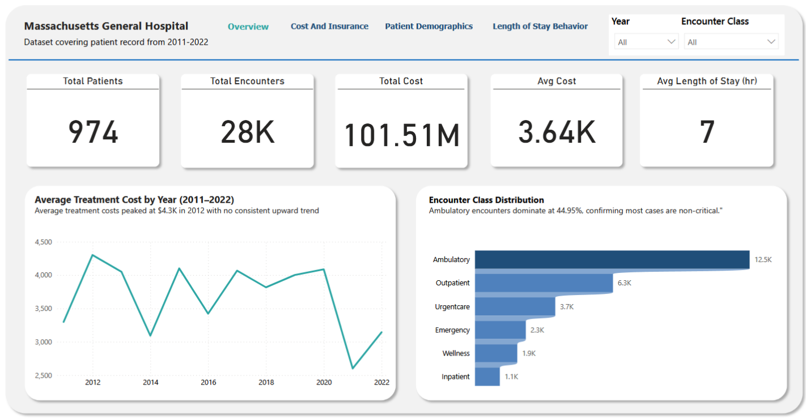

# 🏥 Massachusetts General Hospital — Patient Analytics Dashboard

> A comprehensive Power BI dashboard analyzing patient records from Massachusetts General Hospital covering **2011–2022**, exploring treatment costs, patient demographics, length of stay, and insurance coverage across 28,000+ encounters.

---

## Table of Contents
- [Introduction](#introduction)
- [Business Objectives](#business-objectives)
- [Key Contents of the Dataset](#key-contents-of-the-dataset)
- [Tools Used](#tools-used)
- [Methodology](#methodology)
- [Data Visualization](#data-visualization)
- [Key Insights](#key-insights)
- [Recommendations](#recommendations)
- [Expected Business Impact](#expected-business-impact)
- [Conclusion](#conclusion)
- [About the Author](#about-the-author)

---

## Introduction

This project presents an end-to-end data analytics solution for Massachusetts General Hospital (MGH), one of the leading healthcare institutions in the United States. Using a dataset covering patient records from 2011 to 2022, this dashboard was built to help hospital administrators, clinical teams, and finance departments make data-driven decisions around patient care, cost management, and resource planning.

The dashboard was developed using **Power BI Desktop** and covers four key analytical areas: hospital overview, cost and insurance, patient demographics, and length of stay behavior.

---

## Business Objectives

The following business questions guided the analysis:

- What factors influence patient length of stay in the hospital?
- How does insurance coverage affect the cost of patient care?
- Which procedures or treatments contribute most to hospital costs?
- Are healthcare costs increasing over time?
- Are certain patient demographics (age, gender, race) associated with longer stays or higher costs?
- Which medical conditions drive the most hospital visits?

---

## Key Contents of the Dataset

| Field | Description |
|---|---|
| Patient ID | Unique identifier for each patient |
| Admission Date | Date and time patient was admitted |
| Discharge Date | Date and time patient was discharged |
| Encounter Class | Type of visit (Ambulatory, Inpatient, Emergency, etc.) |
| Medical Condition | Primary diagnosis or condition |
| Medical Procedure | Treatment or procedure performed |
| Gender | Patient gender |
| Age Group | Patient age bracket (26+) |
| Race | Patient race/ethnicity |
| Total Claim Cost | Total cost billed for the encounter |
| Payer Coverage | Amount covered by insurance |
| Insurance Provider | Name of the insurance payer |

> **Dataset period:** 2011–2022 | **Total encounters:** 28,000+ | **Total patients:** 974

---

## Tools Used

| Tool | Purpose |
|---|---|
| **Power BI Desktop** | Dashboard development and data visualization |
| **Power Query** | Data cleaning, transformation, and column creation |
| **DAX** | Custom measures and calculated columns |
| **Microsoft Excel** | Initial data exploration and validation |
| **GitHub** | Portfolio documentation and project hosting |

---

## Methodology

1. **Data Collection** — Obtained raw hospital patient records dataset covering 2011–2022
2. **Data Cleaning** — Handled missing values, standardized date formats (converted ISO 8601 format), and removed duplicates in Power Query
3. **Feature Engineering** — Created a calculated **Length of Stay** column by subtracting Admission Date from Discharge Date using:
   ```
   Duration.TotalMinutes(DateTime.From([Discharge Date]) - DateTime.From([Admission Date]))
   ```
4. **LOS Grouping** — Created length of stay buckets (0–1 hr, 2–8 hrs, 8–12 hrs, 12+ hrs) using a custom DAX column
5. **Data Modeling** — Built relationships between tables and created DAX measures for key KPIs
6. **Visualization** — Designed 4 interactive dashboard pages with filters, drill-throughs, and insight annotations
7. **Validation** — Cross-checked Power BI results against Excel calculations to ensure accuracy

---

## Data Visualization

The dashboard consists of **4 interactive pages:**

### 1. Overview


High-level hospital performance summary including:
- Total Patients: **974**
- Total Encounters: **28K**
- Total Cost: **$101.51M**
- Average Cost: **$3.64K**
- Average Length of Stay: **7 hours**
- Average Treatment Cost by Year (2011–2022)
- Encounter Class Distribution

### 2. Cost & Insurance


- Average treatment cost by medical procedure — top 5 procedures
- Total cost by insurance provider
- Total treatment cost vs insurance coverage by payer

### 3. Patient Demographics


- Average treatment cost by age group (26+)
- Average treatment cost by gender
- Ethnicity distribution (Hispanic vs Non-Hispanic)
- Patient distribution by race

### 4. Length of Stay & Behavior


- Distribution of length of stay across time buckets
- Relationship between length of stay and treatment cost
- Top 5 medical conditions driving hospital visits
- Average length of stay by encounter class

---

## Key Insights

- 📈 **Average treatment costs peaked at $4.3K in 2012** with no consistent upward trend since
- 💊 **Ambulatory encounters dominate at 44.95%** confirming most cases are non-critical
- 💰 **Myocardial infarction is the costliest procedure at $66K** — heart-related procedures drive the highest costs
- 🚨 **Uninsured patients generate $49M in claims with zero payer coverage** — the largest financial risk to the hospital
- 👥 **Patients aged 26–40 incur the highest average treatment cost at $6.9K** across all age groups
- ⚧ **Male patients average $800 more per encounter ($4.1K vs $3.3K)** — possibly driven by higher-acuity visit types
- 🏥 **83.4% of patients are Non-Hispanic** — showing uneven demographic representation
- 🧑🏻 **White patients account for 19.5K visits** — the most of any racial group
- ⏱ **Most patients (24K) stay under 1 hour** consistent with high ambulatory and outpatient volume
- 🛏 **Inpatient stays average 37 hours** — significantly longer than all other encounter classes
- 🫀 **Chronic congestive heart failure (1,738 visits) is the top recorded condition** driving hospital visits
- 💸 **Treatment costs peak at $8.2K for stays over 12 hours** consistent with complex inpatient and emergency cases

---

## Recommendations

| # | Insight | Recommendation | Stakeholder |
|---|---|---|---|
| 1 | No consistent cost upward trend | Monitor annual cost fluctuations and investigate outlier years like 2012 | Finance Department |
| 2 | Ambulatory encounters dominate | Prioritize investment in ambulatory and outpatient facilities | Resource Planning Team |
| 3 | Myocardial infarction costs $66K avg | Develop targeted cardiac cost management and preventive cardiology programs | Clinical & Finance Teams |
| 4 | Uninsured patients = $49M uncovered | Build financial assistance programs and drive insurance enrollment initiatives | Finance & Patient Services |
| 5 | Patients aged 26–40 have highest costs | Investigate cost drivers in younger patients and develop early intervention programs | Clinical Team |
| 6 | Male patients cost 24% more | Investigate encounter type mix and launch male health awareness campaigns | Clinical & Outreach Teams |
| 7 | Inpatient stays average 37 hours | Review inpatient care protocols to identify efficiency opportunities | Operations Team |
| 8 | Heart failure is top condition | Prioritize chronic disease management programs to reduce repeat visits | Clinical Management |

---

## Expected Business Impact

- **Cost Reduction** — Targeted cardiac and chronic disease interventions could significantly reduce the hospital's highest-cost procedure volumes
- **Revenue Protection** — Addressing the $49M uninsured coverage gap through financial assistance and enrollment programs reduces financial risk
- **Operational Efficiency** — Better resource allocation for ambulatory services (44.95% of volume) improves patient throughput and reduces wait times
- **Improved Patient Outcomes** — Early intervention programs for high-risk demographics (male patients, 26–40 age group) could reduce late-stage, high-cost presentations
- **Data Quality** — Standardizing data collection for medical conditions will enable deeper clinical insights in future analyses

---

## Conclusion

This dashboard provides Massachusetts General Hospital stakeholders with a clear, data-driven view of patient activity, cost drivers, and demographic patterns across 11 years of records. The analysis reveals that while most encounters are non-critical and short in duration, a small number of high-acuity procedures and uninsured patients account for a disproportionate share of hospital costs.

The recommendations focus on four key priorities: **cardiac care cost reduction, uninsured patient financial risk management, resource planning for high-volume encounters, and demographic-targeted outreach** — all aimed at improving operational efficiency and patient outcomes.

---

## About the Author

**Abigail Abiodun**

Aspiring Data Analyst with a passion for transforming raw data into actionable insights. Experienced in building interactive dashboards and reports using Power BI, with hands-on skills in data cleaning, DAX, Power Query, and Excel.

This project is part of a structured data analytics portfolio developed to demonstrate real-world analytical thinking, problem-solving, and visualization skills in the healthcare industry.

🔗 **GitHub:** [https://github.com/Opsy-001]
🔗 **LinkedIn:** www.linkedin.com/in/abigail-abiodun-0205903a7

---

*Last Updated: May 2026 | Dataset: Massachusetts General Hospital Patient Records 2011–2022*

