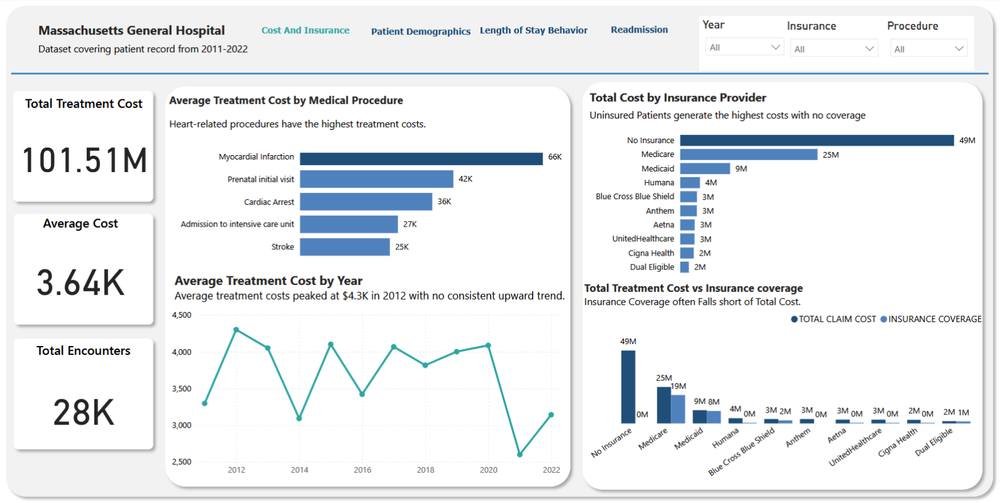
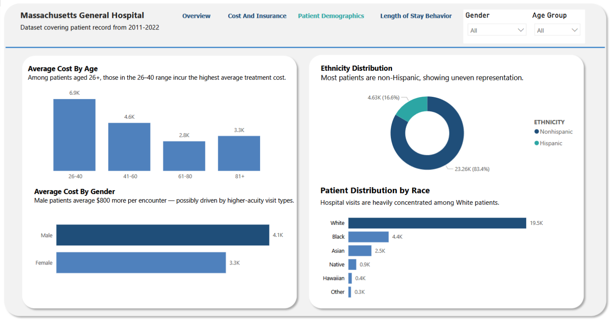
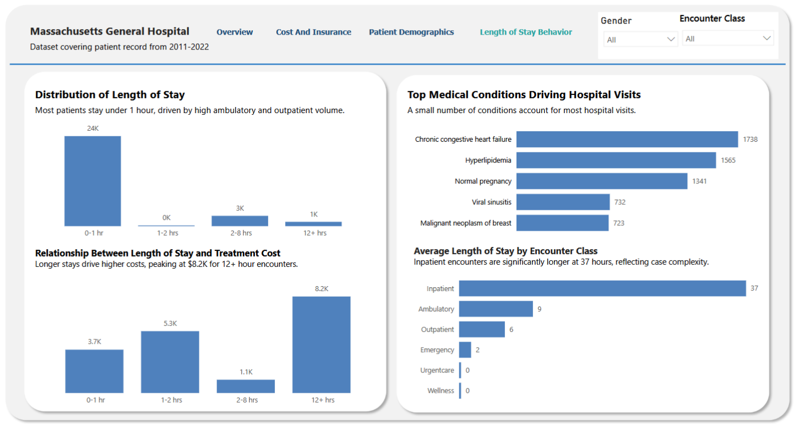
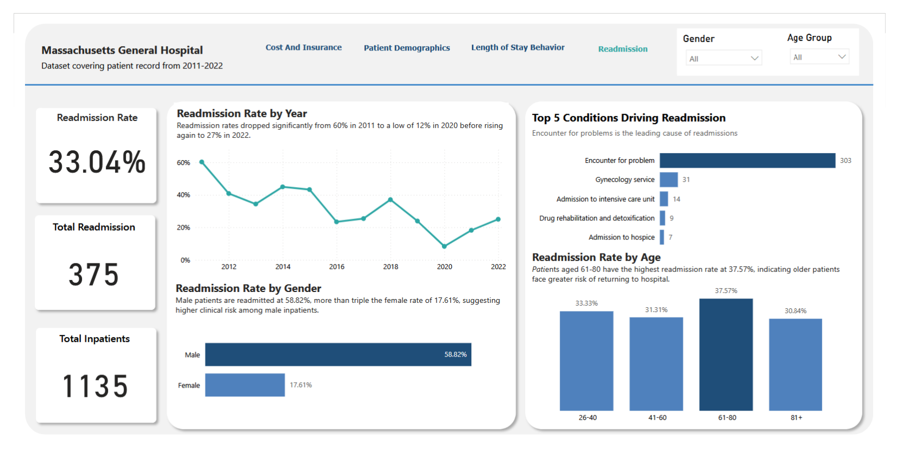

# 🏥 Massachusetts General Hospital — Patient Analytics Dashboard


> This project analyzes a synthetic dataset modeled after Massachusetts General Hospital (MGH), covering patient records from **2011–2022**. It focuses on uncovering insights into treatment costs, patient demographics, length of stay, insurance coverage, and inpatient readmission across 28,000+ encounters.

---

## Table of Contents
- [Introduction](#introduction)
- [Business Objectives](#business-objectives)
- [Key Contents of the Dataset](#key-contents-of-the-dataset)
- [Tools Used](#tools-used)
- [Methodology](#methodology)
- [Data Visualization](#data-visualization)
- [Key Insights](#key-insights)
- [Recommendations](#recommendations)
- [Expected Business Impact](#expected-business-impact)
- [Conclusion](#conclusion)
- [About the Author](#about-the-author)

---


## Introduction

This project presents an end-to-end data analytics solution using a **synthetic dataset modeled after Massachusetts General Hospital (MGH)**, one of the leading healthcare institutions in the United States. The dataset covers patient records from **2011 to 2022** and is used to support data-driven decision-making in areas such as patient care, cost management, and resource planning.

The dashboard was developed using **Power BI Desktop** and focuses on four key analytical areas: **cost and insurance, patient demographics, length of stay behavior, and inpatient readmission analysis**. It is designed to provide actionable insights for hospital administrators, clinical teams, and finance departments.

---

## Business Objectives

The following business questions guided the analysis:

- What factors influence patient length of stay in the hospital?
- What is the rate of patient readmission within 30 days, and what patterns exist?
- How does insurance coverage affect the cost of patient care?
- Which procedures or treatments contribute most to hospital costs?
- Are healthcare costs increasing over time?
- Are certain patient demographics (age, gender, race) associated with longer stays or higher costs?

---

## Key Contents of the Dataset

| Field | Description |
|---|---|
| Patient ID | Unique identifier for each patient |
| Admission Date | Date and time patient was admitted |
| Discharge Date | Date and time patient was discharged |
| Encounter Class | Type of visit (Ambulatory, Inpatient, Emergency, etc.) |
| Medical Condition | Primary diagnosis or condition |
| Medical Procedure | Treatment or procedure performed |
| Gender | Patient gender |
| Age Group | Patient age bracket (26+) |
| Race | Patient race/ethnicity |
| Total Claim Cost | Total cost billed for the encounter |
| Payer Coverage | Amount covered by insurance |
| Insurance Provider | Name of the insurance payer |

> **Dataset period:** 2011–2022 | **Total encounters:** 28,000+ | **Total patients:** 974 | **Total inpatients Encounters:** 1,135

---

## Tools Used

| Tool | Purpose |
|---|---|
| **Power BI Desktop** | Dashboard development and data visualization |
| **Power Query** | Data cleaning, transformation, and column creation |
| **DAX** | Custom measures and calculated columns |
| **Microsoft Excel** | Data exploration, validation, and inpatient readmission column creation |
| **GitHub** | Portfolio documentation and project hosting |

---

## Methodology

1. **Data Cleaning** — Handled missing values, standardized date formats (converted ISO 8601 format), and removed duplicates in Power Query
3. **Feature Engineering** — Created a calculated **Length of Stay** column by subtracting Admission Date from Discharge Date using:
   ```
   Duration.TotalMinutes(DateTime.From([Discharge Date]) - DateTime.From([Admission Date]))
   ```
4. **LOS Grouping** — Created length of stay buckets (0–1 hr, 2–8 hrs, 8–12 hrs, 12+ hrs) using a custom DAX column
5. **Readmission Analysis** — Created an **Inpatient Readmission** column in Excel to identify patients with more than one inpatient encounter within 30 days, then created a **Readmission Flag** calculated column in Power BI to classify each encounter accordingly
6. **Data Modeling** — Built relationships between tables and created DAX measures for all KPIs including readmission rate, total readmissions, and readmission rate by gender and age group
7. **Visualization** — Designed 4 interactive dashboard pages with filters, drill-throughs, and insight annotations
8. **Validation** — Cross-checked Power BI results against Excel calculations to ensure accuracy

---

## Data Visualization

The dashboard consists of **4 interactive pages:**

### 1. Cost & Insurance
- Treatment cost trends, insurance contribution, and financial exposure
  



### 2. Patient Demographics
- Cost distribution across age, gender, race, and ethnicity
  



### 3. Length of Stay Behavior
-  Patient stay patterns and relationship with cost
  



### 4. Readmission
- Readmission rates, trends, and risk segments
  



---

## Key Insights

### 💰 Cost & Financial Insights

* 📈 Average treatment costs peaked at **$4.3K in 2012**, with no consistent upward trend over time
* 💊 **Myocardial infarction ($66K)** is the costliest procedure, indicating heart-related conditions drive the highest expenses
* 🚨 **Uninsured patients generate $49M in claims with zero coverage**, representing the largest financial risk
* 💸 Treatment costs increase with length of stay, peaking at **$8.2K for stays over 12 hours**

---

### 🏥 Patient Behavior & Hospital Utilization

* 💊 **Ambulatory encounters dominate (44.95%)**, confirming most visits are non-critical
* ⏱ **Most patients (24K) stay under 1 hour**, reflecting high outpatient volume
* 🔀 Patient stays cluster at **under 1 hour or over 2 hours**, indicating a split between quick visits and extended care
* 🛏 **Inpatient stays average 37 hours**, significantly longer than other encounter types

---

### 👥 Demographics Insights

* 👥 Patients aged **26–40 incur the highest average treatment cost ($6.9K)**
* ⚧ Male patients have higher average costs (**$4.1K vs $3.3K**), possibly due to higher-acuity cases
* 🏥 **83.4% of patients are Non-Hispanic**, showing uneven demographic representation
* 🧑🏻 **White patients account for 19.5K visits**, the highest among all racial groups

---

### 🫀 Medical Conditions Insights

* 🫀 **Chronic congestive heart failure (1,738 visits)** is the most common condition driving hospital visits
* 🏥 A small number of conditions contribute disproportionately to overall hospital utilization

---

### 🔁 Readmission Insights

* 🔁 **Readmission rate is 33.04%**, significantly higher than common benchmarks (~15%), indicating potential care quality concerns
* 👨 Male patients have a higher readmission rate (**58.82%**) compared to females (**17.61%**)
* 👴 Patients aged **61–80 have the highest readmission rate (37.57%)**, showing increased risk among older patients
* 📉 Readmission rates declined from **60% (2011) to 12% (2020)** before rising again to **27% (2022)**
* 🏨 **"Encounter for problem"** is the leading cause of readmissions (303 cases)

---

## Recommendations


| #  | Insight                                                    | Recommendation                                                                                                                                                          | Stakeholder                             |
| -- | ---------------------------------------------------------- | ----------------------------------------------------------------------------------------------------------------------------------------------------------------------- | --------------------------------------- |
| 1  | No consistent cost upward trend                            | Establish continuous cost monitoring dashboards and investigate cost spikes (e.g., 2012) to identify underlying drivers such as procedure mix or patient volume changes | Finance Department                      |
| 2  | Ambulatory encounters dominate (44.95%)                    | Expand and optimize outpatient and ambulatory care services to improve efficiency, reduce congestion, and lower operational costs                                       | Operations & Resource Planning Teams    |
| 3  | Myocardial infarction is the highest-cost procedure ($66K) | Implement targeted cardiac care programs, including preventive screening and early intervention strategies, to reduce high-cost emergency cases                         | Clinical & Preventive Care Teams        |
| 4  | Uninsured patients account for $49M in uncovered costs     | Introduce structured financial assistance programs and strengthen insurance enrollment initiatives to reduce uncompensated care                                         | Finance & Patient Services              |
| 5  | Patients aged 26–40 incur the highest costs                | Conduct deeper analysis to identify cost drivers (e.g., lifestyle-related conditions or emergency visits) and design targeted preventive health programs                | Clinical & Analytics Teams              |
| 6  | Male patients have higher treatment costs                  | Analyze clinical and behavioral factors contributing to higher male patient costs and develop targeted awareness and early intervention programs                        | Clinical & Public Health Teams          |
| 7  | Inpatient stays average 37 hours                           | Review inpatient workflows and discharge processes to identify inefficiencies and reduce unnecessary extended stays                                                     | Hospital Operations Team                |
| 8  | Chronic heart failure is the most frequent condition       | Prioritize chronic disease management programs (e.g., monitoring, follow-ups) to reduce repeat visits and long-term treatment costs                                     | Clinical Management Team                |
| 9  | Readmission rate is 33.04% (above expected benchmarks)     | Implement structured post-discharge follow-up programs, including patient education, remote monitoring, and scheduled check-ins to reduce preventable readmissions      | Clinical Team & Hospital Administration |
| 10 | Male patients have the highest readmission rate (58.82%)   | Develop targeted discharge planning and follow-up care strategies specifically for high-risk male patients                                                              | Clinical & Patient Support Teams        |
| 11 | Patients aged 61–80 have the highest readmission risk      | Strengthen geriatric care programs, including medication reviews, home care support, and regular follow-ups to reduce readmissions                                      | Geriatric Care Team                     |
| 12 | Readmissions driven by "Encounter for problem" cases       | Improve diagnosis accuracy and treatment resolution during initial visits to minimize unresolved conditions leading to repeat admissions                                | Clinical Quality & Assurance Team       |


---

## Expected Business Impact

* **Cost Optimization** — Identifying high-cost procedures and length-of-stay drivers enables targeted interventions to reduce unnecessary expenses

* **Revenue Protection** — Addressing the $49M uninsured coverage gap through financial assistance and insurance enrollment initiatives helps reduce financial risk

* **Operational Efficiency** — Expanding and optimizing ambulatory services (44.95% of encounters) improves patient flow and reduces hospital congestion

* **Reduced Readmissions** — Implementing structured discharge planning and follow-up programs can help lower the 33.04% readmission rate, improving both patient outcomes and resource utilization

* **Improved Patient Outcomes** — Targeted interventions for high-risk groups (male patients and older age groups) support better care delivery and reduce repeated hospital visits

* **Enhanced Decision-Making** — Data-driven insights enable hospital stakeholders to make informed decisions on resource allocation, care strategies, and financial planning

---
## Skills Demonstrated

- Data Cleaning (Power Query, Excel)
- Data Transformation
- Feature Engineering
- DAX Calculations
- Data Modeling
- Dashboard Design
- Data Visualization
- Business Analysis
- Data Storytelling
- Stakeholder Communication

---  
## Conclusion

This dashboard provides stakeholders with a clear, data-driven view of patient activity, cost drivers, demographic patterns, and readmission trends across 11 years of records. The analysis shows that while most encounters are non-critical and short in duration, a small number of high-acuity procedures, uninsured patients, and preventable readmissions account for a disproportionate share of hospital costs and resource utilization.

The inpatient readmission rate of **33.04% — significantly higher than commonly reported benchmarks (~15%)** — emerges as the most critical finding, highlighting the need for improved discharge planning and structured post-care follow-up programs.

Overall, the recommendations focus on five key priorities: **cardiac care cost reduction, uninsured patient financial risk management, resource optimization for high-volume encounters, targeted interventions for high-risk demographics, and readmission reduction** — all aimed at improving operational efficiency, financial sustainability, and patient outcomes.


---

## About the Author

**Abigail Abiodun**
🔗 **LinkedIn:** https://www.linkedin.com/in/abigail-abiodun-0205903a7

---
🏆 Award: Best Presentation – STC Data Analyst Project

---
*Last Updated: May 2026 | Dataset: Massachusetts General Hospital Patient Records 2011–2022*

